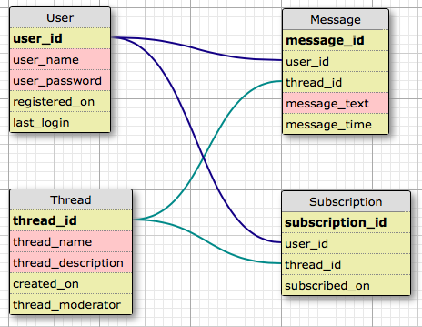

# Chatterwerks

_A chat that works_

Heroku Links:

Heroku live/production <a href="https://otterwerks-chat-app.herokuapp.com">HERE</a>

Heroku development/staging <a href="https://otterwerks-chat-staging.herokuapp.com">HERE</a>


<br>

<p>&nbsp&nbsp&nbsp&nbsp&nbsp&nbsp&nbsp&nbsp&nbsp&nbsp&nbsp&nbsp&nbsp&nbsp&nbsp&nbsp&nbsp&nbsp&nbsp&nbsp&nbsp&nbsp&nbsp&nbsp&nbsp&nbsp&nbsp&nbsp&nbsp&nbsp&nbsp&nbsp&nbsp&nbsp&nbsp&nbsp&nbsp&nbsp</p>

<br>


This project was bootstrapped with [Create React App](https://github.com/facebook/create-react-app).

## Summary
Chatterwerks is a simple chat application that focuses on utilizing a PostgreSQL relational database to keep track of users, channels, channel subscriptions, and messages. 

## Hey Otter!
Otter is the chat bot in the home channel that I adapted from a command line <a href="https://github.com/Otterwerks/Virtual-Otter">virtual assistant</a> script I had made some time ago. Otter can assist with arithmetic as well as the date and time.

- Talk to Otter by starting off your message with ```Hey Otter, ```

## Features
- Home chat channel with chat bot
- Private chat channels between users, click a username to start a private chat
- Back End strict and acceptance tested with Pytest
- Deployed using the Heroku development pipeline
- Responsive Bootstrap 4 design


## Security
In designing this project I wanted to make sure that users would not be able to manipulate data stored in the browser to gain unauthorized access to channels or submit fraudulent messages. The login process for Chatterwerks simply verifies that an associated User ID exists in the User table for the submitted credentials and stores those credentials in the browser for future requests if they are valid. 

#### Loading channel messages
User credentials are submitting with this request in order to allow the backend to resolve a User ID. The User ID is then validated in the Subscription table to see if that User ID is allowed to view messages in the channel and messages are returned in the response if the user is subscribed.

#### Sending a message
Sending a message also involves submitting user credentials to not only authorize the user but also validate that the user is subscribed to the channel they are attempting to submit a message to.

## Technical
Clients use interval polling to receive new messages from the database. I understand this method carries additional network overhead and I chose to implement this method because it allowed me to continue making progress in developing other aspects of the project.

- Front End (JavaScript)
  - React
  - React-Router
  - Redux
  - Axios
- Back End (Python)
  - Flask
  - SQLAlchemy
  - PyTest
  - PostgreSQL
  - Gunicorn
- Hosts
  - Heroku Pipeline (staging/production)
  - Heroku Postgres add-on, two separate for staging and production
  
#### Database Structure


- Bold: primary key
- Lines: foreign key relationship
- Red: integer data type
- Yellow: string/text data type
- Note: the ```Thread``` table now has an additional column ```thread_moderator```

  
#### Known Polling Bug
The polling works by setting a delay to update the client store with new information through an HTTP request. The delayed function is set to run when the chat component renders. Under normal circumstances this works as intented because the new data from the request triggers a rerendering of the component and sets a new delayed function, so on and so forth. The problem is that any other interaction that causes the component to rerender will trigger additional delayed requests. This means that every time the user selects a different chat channel, an unnecessary parallel request is initialized. While this can make the application be perceived as 'speedier', it is not the intended behavior and has the potential to result in continuous back to back requests. The structure of the request function sets a ```queryStatus``` store value to ```requested``` after the request is sent and ```complete``` after a response is received. A new request can only be made if the ```queryStatus``` is ```complete``` to prevent request overlap. I believe the most straightforward way to solve this is to place the request into an isolated component.

## Resources Used:
- <a href="https://redux.js.org/basics/example">Redux JS To-Do Example</a>
- <a href="https://redux.js.org/advanced/usage-with-react-router">Redux JS with React Router</a>
- <a href="http://flask-sqlalchemy.pocoo.org/2.3/">Flask-SQLAlchemy Documentation</a>
- <a href="http://www.postgresqltutorial.com/">PostgreSQL Tutorials</a>
- <a href="https://www.udemy.com/react-2nd-edition/">The Complete React Web Developer Course (with Redux)</a>
- <a href="https://getbootstrap.com/docs/4.0/getting-started/introduction/">Bootstrap Quickstart Documentation</a>
- My previous project <a href="https://github.com/Otterwerks/Tweet-Finder">Tweet-Finder</a>
- <a href="http://flask.pocoo.org/docs/1.0/testing/">Testing Flask Applications</a>
